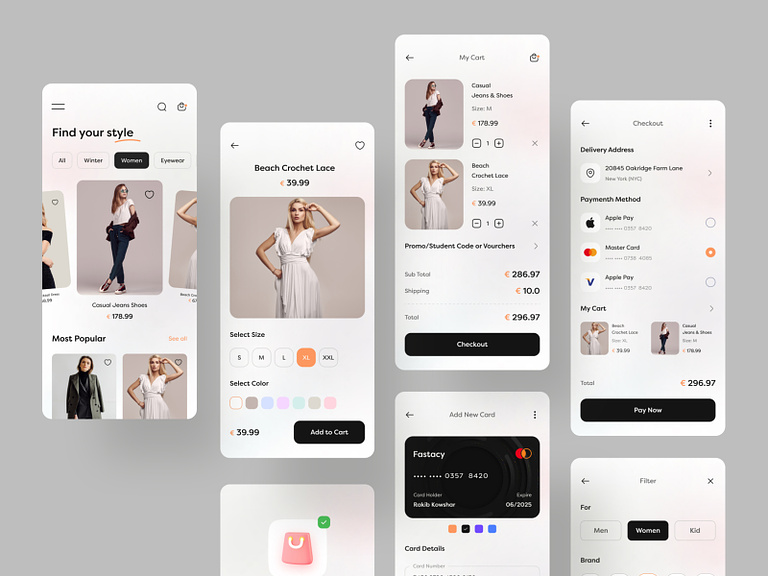

ShopMasters Fashion eCommerce App: Your ultimate Products App
(Still working on it)
> 

> Follow us for more projects like this [Check on our website](https://usmandotdev.netlify.app/)
>  
By capturing the Power of React Native , NodeJS & MongoDB,I have Developed a Full Stack Ecommerce App By using the Power of React Native Redux Toolkit,NodeJS for Rest API's and MongoDB for our DataBase with React Reanimated.This app is fully Functional having Authentication system with Stripe payment gateway for payment process.This app covers all the aspects of a Ecommerce application.

# React Native

React Native is a popular JavaScript framework that allows you to build native mobile apps using a single codebase. You will learn how to develop cross-platform mobile applications for both iOS and Android platforms, leveraging the efficiency and flexibility of React Native.

# Node JS

"Our E-commerce project, built with the power of React Native, Node.js, and Express.js, offers a seamless and engaging shopping experience for users on both Android and iOS platforms. Leveraging the cross-platform capabilities of React Native, we've developed a dynamic mobile app that provides a user-friendly interface, smooth navigation, and real-time product updates.

The front-end, developed using React Native, ensures a responsive and consistent design across devices, enabling customers to effortlessly browse through a diverse range of products, add items to their carts, and proceed to secure checkout. The app also features personalized user profiles, order history, and wish lists, enhancing the sense of customer ownership.

On the back-end, Node.js and Express.js power the server-side operations, handling data processing, authentication, and communication with the database. This dynamic duo enables real-time inventory management, secure user authentication, and efficient order processing, ensuring a reliable and secure shopping experience.

With our E-commerce project, we've combined the versatility of React Native and the robustness of Node.js and Express.js to create a feature-rich, responsive, and scalable mobile application that brings the excitement of shopping right to the fingertips of users."

# Express JS
Our React Native E-commerce application is powered by Express.js, a fast and flexible backend framework. Express.js seamlessly handles server-side operations, API requests, and data management, ensuring a smooth and secure shopping experience for our users.

With Express.js, we've built a robust and scalable backend that efficiently communicates with our database and serves as the bridge between the front-end React Native app and the data it requires. This allows for real-time product updates, user authentication, and efficient handling of orders and payments.

By utilizing Express.js, we've structured our application's API routes and middleware in a clean and organized manner. This modular approach simplifies the development process and allows for easy integration of additional features, such as user profiles, order tracking, and personalized recommendations.

Express.js also ensures the security of our application through features like input validation, data sanitization, and protection against common web vulnerabilities. This helps to safeguard user information and maintain the integrity of our E-commerce platform.

Through the power of Express.js, our React Native E-commerce application achieves a seamless connection between the front-end and the backend, resulting in a high-performance, secure, and feature-rich shopping experience for our valued customers

# Hybrid App Development

By using React Native, you will gain experience in building hybrid mobile apps, which provide the advantage of code reusability across multiple platforms. This project will help you understand the fundamentals of hybrid app development and how to leverage the strengths of React Native to deliver a consistent user experience on both iOS and Android.

  

# Redux Toolkit
Our project harnesses the power of Redux Toolkit to efficiently manage the shopping cart system in an E-commerce application. Redux Toolkit simplifies the complexities of state management, offering a streamlined and intuitive approach.

With Redux Toolkit, we've centralized the cart state, making it easily accessible from any component within the application. This ensures consistency across the user interface, allowing customers to view their added items, quantities, and prices in real time.

The cart system is integrated seamlessly with the rest of the application, enabling dynamic updates as users add, remove, or modify items in their carts. Redux Toolkit's slice reducers and immer integration facilitate seamless state updates without the usual boilerplate code, leading to cleaner and more maintainable codebase.

In addition, Redux Toolkit's devtools extension offers deep insights into the application's state changes, making debugging and optimization a breeze. This ensures a smooth and error-free shopping experience for our users.

By leveraging Redux Toolkit for our cart system, we've achieved a well-organized, efficient, and reliable solution that enhances the user experience and provides a solid foundation for scaling and expanding our E-commerce application.

# UI/UX Designs

Creating an appealing and user-friendly interface is crucial for a beauty product shop app. You will have the opportunity to enhance your UI/UX design skills and implement intuitive navigation, stunning visuals, and smooth animations to provide an engaging user experience.

# API Integrations

You will learn how to interact with external APIs to fetch additional data, such as user reviews, product ratings, and stock availability. This integration will allow you to provide up-to-date information to users and enhance the functionality of the app.

# Clone a whole Project
To clone a React Native project from GitHub, follow these simple steps:

1): Install Git: Make sure you have Git installed on your system. You can download and install it from the official Git website.

2): Navigate to GitHub: Go to the GitHub repository of the React Native project you want to clone.

3): Clone the Repository: On the GitHub repository page, look for the green 'Code' button. Click on it to reveal a URL. You can choose between HTTPS and SSH URLs. If you're new to this, start with HTTPS.

4): Open Terminal or Command Prompt: Open your terminal or command prompt on your local machine.

5): Navigate to Desired Directory: Use the cd command to navigate to the directory where you want to store the cloned project. For example:
cd Documents/Projects

6): Clone the Repository: In the terminal, paste the URL you copied from the GitHub repository and use the git clone command to clone the project. For HTTPS URL:
cd repository-name

7): Install Dependencies: React Native projects usually have dependencies that need to be installed. Run the following command to install them:
npm install

8): Start the Frontend React Native Project: Depending on the project, you might have different ways to start it. Typically, for a React Native project, you would use:
npm start or npx react-native start

9): Start the Backend Node Server : Depending on the project, you might have different ways to start it. Typically, for Node project, you would use:
npm start 

Explore the Project: The cloned React Native project is now running on your local machine. You can explore the code, make modifications, and see the changes live on the emulator or device.

10): By following these steps, you'll successfully clone a React Native project from GitHub and have it up and running on your local development environment."

# To start the React Native server

npm start &  npx react-native start

# To start the Node server

npm start

# Features
Add to cart,Delete from cart,increment or decrement from cart,Login or Register the user,Stripe Payment,Light or Dark theme,Live Search Functionality ,Better UI/UX and many more.
 # Note
 some features are miss i am still working on it.

